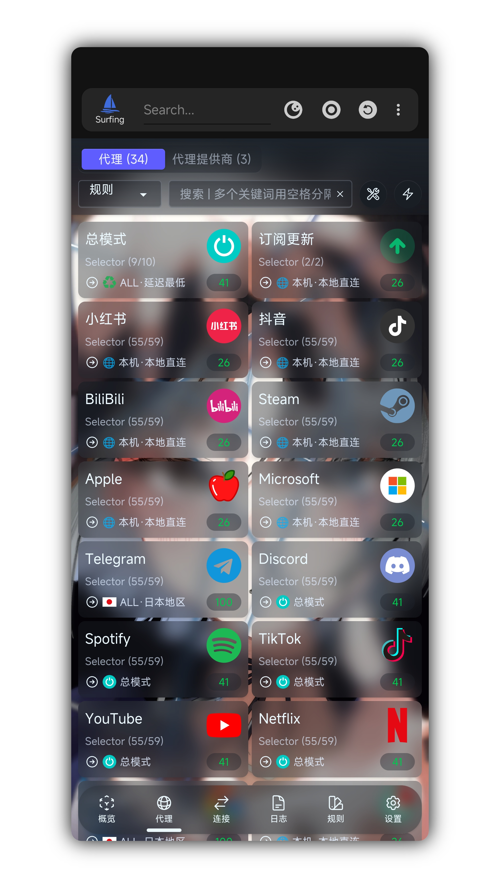

<h1 align="center">
  
   Surfing 
</h1>

<h3 align="center">Magisk, Kernelsu, APatch</h3>

    
    

 

    <a href="./README.md">English</a> | <strong>简体中文</strong>

---

本项目为 Clash/mihomo、sing-box、v2ray、xray、hysteria 的 [Magisk](https://github.com/topjohnwu/Magisk) 、 [Kernelsu](https://github.com/tiann/KernelSU) 、 [APatch](https://github.com/bmax121/APatch) 模块。支持 REDIRECT（仅 TCP）、TPROXY（TCP + UDP）透明代理，支持 TUN（TCP + UDP）亦可 REDIRECT（TCP）+ TUN（UDP） 混合模式代理。

基于上游为集成式一体服务、开箱即用   
此适用以下人群：
- 懒癌
- 小白

项目主题及配置仅围绕 [Clash/mihomo.Meta](https://github.com/MetaCubeX/Clash.Meta)  

本模块需在 Magisk/Kernelsu 环境进行使用，如果你不知道如何配置所需环境，你可能需要像 ClashForAndroid、v2rayNG、surfboard、SagerNet、AnXray 等应用程序。  

[Windows 用户](https://github.com/GitMetaio/Surfing/releases/tag/Windows)

# Surfing用户声明及免责

欢迎使用 在使用本项目前，请您仔细阅读并理解以下声明及免责条款。通过使用本项目，即表示您同意接受以下条款和条件。以下简称 **Surfing**

## 免责声明

1. **本项目是一个开源项目，仅供学习和研究之用，不提供任何形式的担保。使用者必须对使用本项目的风险和后果负全部责任。**

2. **本项目仅为简化 Surfing 对 Clash 服务在 Android Magisk 环境中的安装和配置提供便利，并不对 Surfing 的功能和性能做出任何保证。如有任何问题或损失，本项目开发者概不负责。**

3. **本项目 Surfing 模块的使用可能会违反您所在地区的法律法规或服务提供商的使用条款。您需要自行承担使用本项目所带来的风险。本项目开发者不对您的行为或使用后果负责。**

4. **本项目开发者不对使用本项目产生的任何直接或间接损失或损害负责，包括但不限于数据丢失、设备损坏、服务中断、个人隐私泄露等。**

## 使用须知

1. **在使用本项目 Surfing 模块前，请确保您已经仔细阅读并理解 Clash 和 Magisk 的使用说明和相关文档，并遵守其规定和条款。**

2. **在使用本项目之前，请先备份您的设备数据和相关设置，以防发生意外情况。本项目开发者不对您的数据丢失或损坏负责。**

3. **请在使用本项目时遵守当地的法律法规，并尊重其他用户的合法权益。禁止使用本项目进行任何违法、滥用或侵权的行为。**

4. **如果您在使用本项目时遇到任何问题或有任何建议，欢迎您向本项目开发者反馈，但开发者对于解决问题和回应反馈没有义务和责任。**

请您在明确理解并接受上述声明及免责条款后，再决定是否使用 Surfing 模块。如果您不同意或无法接受上述条款，请立即停止使用本项目。

## 法律适用

**在使用本项目的过程中，您须遵守您所在地区的法律法规。如有任何争议，应依照当地法律法规进行解释和处理。**

## 安装

- 从 [Release](https://github.com/GitMetaio/Surfing/releases) 页下载模块压缩包，然后通过 Magisk Manager 或 KernelSU Manager 或 APatch 安装
- 各版本变化 [📲日志.log](changelog.md)

## 卸载

 - 从 Magisk Manager 、Kernelsu Manager 、APatch 应用卸载本模块即可 [👉🏻铲屎流程](https://github.com/GitMetaio/Surfing/blob/main/uninstall.sh#L3-L4)

> 通过管理器卸载本模块，会卸载所有相应的服务数据，Web 等 SurfingTile 磁贴应用数据

## Wiki

1. 首次使用

- 首次安装模块完成后，**请先**于 `/data/adb/box_bll/clash/config.yaml` 添加你的订阅地址，亦或者通过 Web 桌面 App(**注意: 需调用SurfingTile且持有Root才能操作**)，随后需手动重启设备一次
- 设备重启后，切换模块开关一次，桌面打开 **Web App** 即可开始使用
- 可能因网络原因不会自动下载完全部 **规则**/**订阅**，请至面板手动刷新一下
- 如遇订阅无法加载请尝试切换配置文件里面的 **Ua**
- 如上述失败，确保你的网络环境正常

- Web App：
    - 可用于通过菜单 → 配置覆写 → 填写订阅
    - 用于便携浏览及管理后台路由数据
    - 启动时会自动更新核心文件

> 如遇面板显示内容异常 / 或内容无法显示  
需通过 Google play 商店更新 com.google.android.webview 组件版本

#

2. 控制运行

- 可通过 WiFi SSID 网络控制启停
- 可通过模块开关进行 关闭/开启 控制运行  
  `操作实时生效无需重启`
- 可向系统状态栏添加模块的控制开关磁贴  
  `如已安装SurfingTile`

#

3. 路由规则

- GitHub Actions 自动构建  
  路由规则全系在线订阅，保证规则最新

> 24小时自动更新

#

4. 后续更新

- 如果你全部使用默认配置，更新将是无感
- 支持在客户端中在线更新模块，更新后无须重启，但仍需建议重启
- 更新时配置文件会备份至
   - `config.yaml.bak`
- 更新时会备份旧文件用户配置，至
   - `box.config.bak`
- 更新时会自动提取你的订阅地址并备份，至
   - `proxies/subscribe_urls_backup.txt`
   - 自动提取备份并恢复至新配置中，适用于使用默认配置文件

> Ps：主要跟随上游更新，及下发一些配置

#

5. 使用问题

### 代理特定应用程序(黑白名单)
- 代理所有应用程序，除了某些特定的应用外，那么请打开 `/data/adb/box_bll/scripts/box.config` 文件，修改 `proxy_mode` 的值为 `blacklist`（默认值），在 `user_packages_list` 数组中添加元素，数组元素格式为`id标识:应用包名`，元素之间用空格隔开。即可**不代理**相应安卓用户应用。例如 `user_packages_list=("id标识:应用包名" "id标识:应用包名")`

- 只代理特定的应用程序，那么请打开 `/data/adb/box_bll/scripts/box.config` 文件，修改 `proxy_mode` 的值为 `whitelist`，在 `user_packages_list` 数组中添加元素，数组元素格式为`id标识:应用包名`，元素之间用空格隔开。即可**仅代理**相应安卓用户应用。例如 `user_packages_list=("id标识:应用包名" "id标识:应用包名")`

安卓用户组id标识：

| 标准用户 | ID  |
| -------- | --- |
| 机主     |  0  |
| 手机分身 |  10  |
| 应用多开 | 999 |

> 通常你可以在`/data/user/`找到本机所有用户组id及应用包名

### Tun模式
- 默认关闭
- 使用黑白名单时需排除相应包名

> 如特殊需要可自行通过配置关闭

### 路由规则
- 为大陆饶行
- 基本能满足大多数日常使用需求

> 在分流规则日益健壮的情况下 黑白名单意义不大

### 面板管理
- Magisk字体模块

> 会影响页面字体正常显示

### 局域网共享
- 开启热点让其它设备连接即可
- Tun 网关: `172.20.0.1`

> 其它设备若访问控制台后端: `http://当前WiFi/Tun网关:9090/ui`

### Host文件
- 无需挂载：删除该文件即可
- 重新挂载：在 **etc文件夹** 新建一个即可
- 所有修改均实时生效
- 更新/安装时可通过音量键 上(**挂载**) 下(**卸载**) 选择

> 域名本地IP重定向，强制绑定

#

6. SurfingTile

### Quick Settings Tile Service
### 📱设备要求
> 支持 Android8+ 建议运行在 Android10+ 上

- 需要工作在**系统空间**，并且持有 **Root** 权限
- 对于 **KSU** 用户，则需要安装 **"元模块"** 才能拥有挂载权限
- 磁贴全程围绕 **Clash API** 工作，请检查 API 设置是否正确
  - **路径:** → Web App → 菜单 → 磁贴设置

### 功能说明
- 支持应用过滤、网络过滤、部分配置覆写 UI 操作
- 支持管理关闭核心连接池的冗余无用数据
### 权限声明
- **GPS 定位**   →    `已保存的无线网络列表` 获取
- **应用列表**    →    `应用软件包列表` 获取

> 应用的所有网络请求都是通过 HttpURLConnection 发起，并且完全用于与本地 Clash 核心服务进行通信。

具体用途如下：

### API 地址
- 默认连接到 `http://127.0.0.1:9090`
- 该地址可以在应用的 API 设置中修改

### 功能

### 1. 检查服务状态
- 通过请求 `/version` 路径来判断 Clash 服务是否正在运行  
- **方法**：`isApiAliveHttp`

### 2. 获取和切换节点
- 通过 `GET` 和 `PUT` 请求到 `/proxies/总模式` 路径  
- 用于获取当前选择的代理节点  
- 在双击磁贴时切换到下一个节点  
- **方法**：`cycleTotalModeProxy`

### 3. 管理连接
- 通过 `GET` 和 `DELETE` 请求到 `/connections` 路径  
- 获取当前的网络连接列表  
- 清理无用的、过时的连接  
- **方法**：
  - `clearAllConnections`
  - `probeAndCleanStaleConnections`

---

### 文件中有两种不同的网络使用场景

### 1. 与本地代理服务通信（核心功能）
- **路径**：`SurfingTileService.java`
- **地址**：`http://127.0.0.1:9090`  
  （或在设置中指定的其他地址）
- **目的**：  
  应用的核心功能，使用该权限通过 HTTP（GET、PUT、DELETE 请求）
  与运行在设备上的 Clash 后台服务进行通信，以实现：
  - 检查服务状态
  - 获取 / 切换代理节点
  - 管理和清理网络连接等功能

### 2. 从网络获取引言（界面功能）
- **路径**：`AppFilterActivity.java`
- **目的**：  
  在应用过滤界面（`AppFilterActivity`）中，应用会从项目 GitHub 地址
  并从中解析和随机显示一条引言，这是一个 UI体验 的**非核心功能**。

`INTERNET` 权限的必要性体现在两个方面：

1. 与本地代理核心进行交互（必须）
2. 从远程服务器获取一个用于解析展示的文本

这是项目中唯一**所有需要网络连接的地方**。

---

### 3. FAQ
- **应用过滤无法显示应用列表**：  
  可先通关闭 SurfingTile 子模块的挂载，重启设备再次进入权限管理给予获取 应用列表权限 / GPS位置权限(WiFi SSID 获取)

- **磁贴响应状态 No Sys** | **No Root**：  
  当前不为系统应用身份 / 当前未持有ROOT权限

- **部分工作路径示意**  
  
  

---

## 致谢

  <a href="https://github.com/CHIZI-0618">
    
     
    <strong>CHIZI-0618</strong>
  </a>

  <a href="https://github.com/MetaCubeX"><strong>MetaCubeX</strong></a>

  <a href="https://github.com/Loyalsoldier"><strong>Loyalsoldier</strong></a>

  
 > 感谢为本项目的实现提供了宝贵的基础 < 

